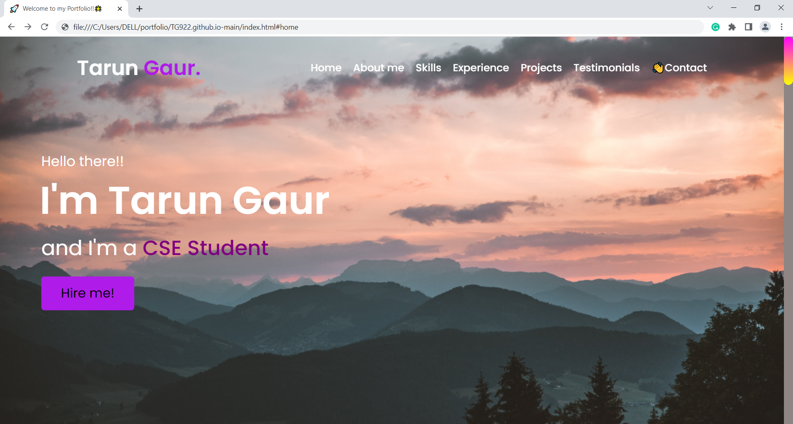
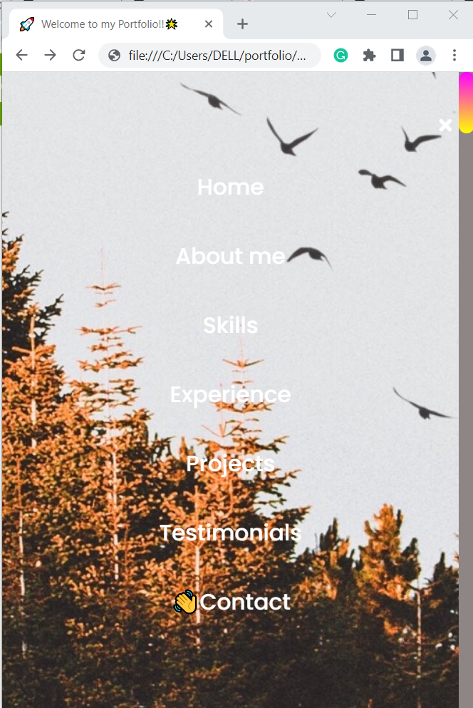
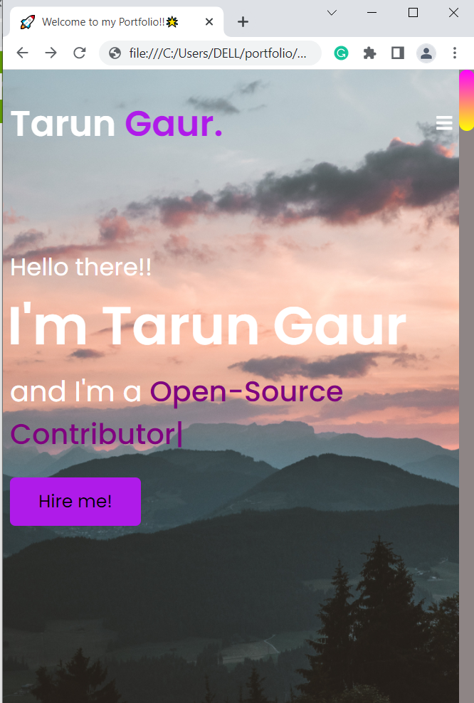
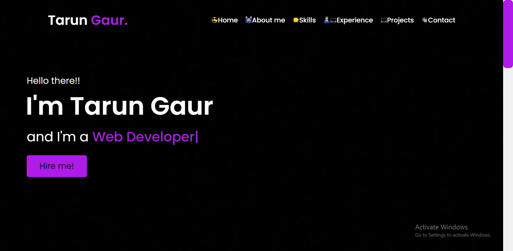
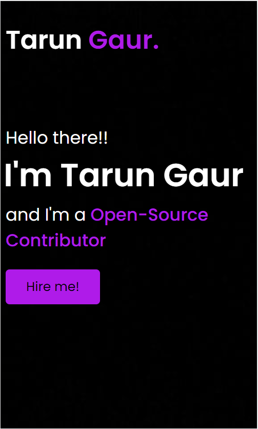

 <h2 align="center"> 
 My Portfolio Website <a href="https://TG922.github.io/" target="_blank">Live Demo</a>
</h2>

  

 
  
 

  

  

<h2 align="center"> 
 My Portfolio Website <a href="https://github.com/TG922/tg-portfolio" target="_blank">(Old Version)</a> 
</h2>

  

 
  
 

  

                                                
  
 
 
 
 
<h3 align="center">
    🔹
    <a href="https://github.com/TG922/TG922.github.io/issues">Report Bug</a> &nbsp; &nbsp;
    🔹
    <a href="https://github.com/TG922/TG922.github.io/issues">Request Feature</a>
</h3>

## Built With

My personal portfolio <a href="https://TG922.github.io/" target="_blank">Live Demo</a> which features some of my github projects as well as my resume and technical skills. 
                                                                
Tech Stack                                                                        

This project was built using these technologies.

- HTML
- CSS
- JS
- Sublime Text Editor

## Usage Instructions

You will find all the components used and you can edit your information accordingly.
                                                                        

 &nbsp;
 &nbsp;
 &nbsp;
<!--  &nbsp;
-->

                                                                        
Give a ⭐ if you like this website!

